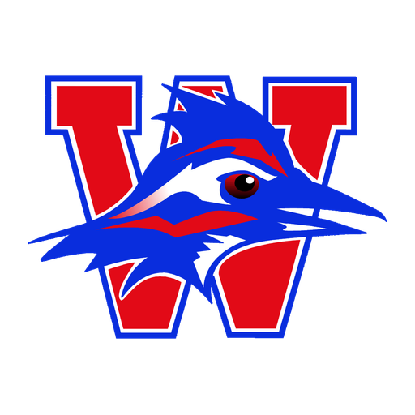

<p align="center">
  
</p>

# Westlake CS Club

The Westlake High School Computer Science Club website, built with React and Vite.

## Development

```sh
npm install
npm run dev
```

The Vite server prints the local URL when it starts. The production homepage is at `/`; the design prototype gallery remains available at `/proto/hero-type-actions/` during development.

## Production build

```sh
npm run build
npm run preview
```

Vite writes the deployable site to `dist/`.
